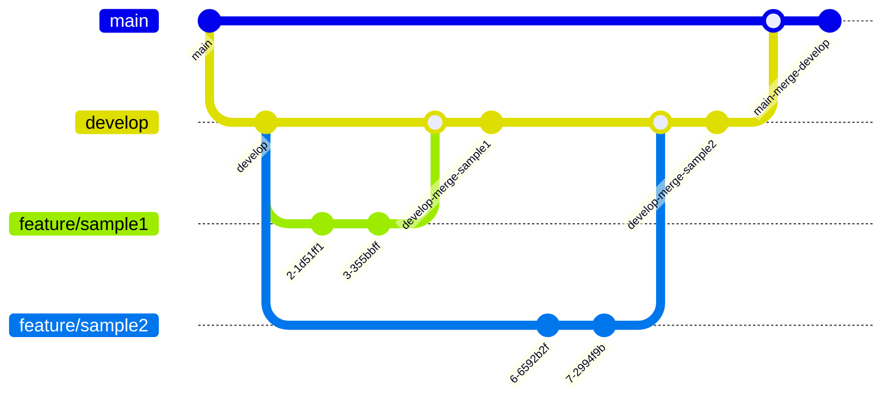

# 自慢プロジェクトコンテンツ

## ブランチ運用

Git Flowを採用

- issueに対応する場合は`feature/issue〇〇`で対応
- Pull Requestでdevelopにマージすることを基本運用とする
- レビューには`@Ryunosuke-Tanaka-sti`を追加

## インフラ

### リソース

- [Frontend:pride-project(Azure Static Web Apps)](https://portal.azure.com/#@ntakeisios.onmicrosoft.com/resource/subscriptions/f682b8b9-db81-412d-97da-c8a2c93d586a/resourceGroups/ryu_test/providers/Microsoft.Web/staticSites/pride-project/staticsite)
- [BFF:pride-content(Azure Web Apps)](https://portal.azure.com/#@ntakeisios.onmicrosoft.com/resource/subscriptions/f682b8b9-db81-412d-97da-c8a2c93d586a/resourceGroups/ryu_test/providers/Microsoft.Web/sites/pride-content/appServices)

## 画面設計書

2024-04-11現在整備中です

[Figma]([https://](https://www.figma.com/file/6Ic1LeHOfLHfkkM5WNMhTb/%E8%A9%A6%E9%A8%93%E5%A0%B4?type=design&node-id=0%3A1&mode=design&t=h5VULBOXgvdlip86-1))
