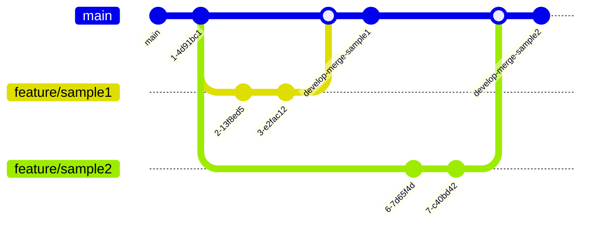

# 自慢プロジェクトフロントエンド

社内で使用している『[自慢プロジェクト](https://blue-ground-0332b1a00.3.azurestaticapps.net/)』のフロントエンドリポジトリです。

## システム構成図


### リポジトリ-ソースコード

- [フロントエンド：ps-pj-pride-project](https://github.com/SIOS-Technology-Inc/ps-pj-pride-project.git)
- [BFF：ps-pj-pride-project-backend](https://github.com/SIOS-Technology-Inc/ps-pj-pride-project-backend.git)

### デプロイ先

- [フロントエンド:pride-project(Azure Static Web Apps)](https://portal.azure.com/#@ntakeisios.onmicrosoft.com/resource/subscriptions/f682b8b9-db81-412d-97da-c8a2c93d586a/resourceGroups/ryu_test/providers/Microsoft.Web/staticSites/pride-project/staticsite)
- [BFF:pride-content(Azure Web Apps)](https://portal.azure.com/#@ntakeisios.onmicrosoft.com/resource/subscriptions/f682b8b9-db81-412d-97da-c8a2c93d586a/resourceGroups/ryu_test/providers/Microsoft.Web/sites/pride-content/appServices)

### 認証・DB

- [本番環境：Firebase](https://console.firebase.google.com/project/react-test-7d3b6/overview?hl=ja)
- [検証環境：Firebase](https://console.firebase.google.com/project/pride-project-local/overview?hl=ja)

## 実行方法

.env.developファイルを生成して、以下のFirebaseとの接続情報を設定
接続情報に関しては、`@Ryunosuke-Tanaka-sti`に問い合わせをお願いします。

```txt
VITE_FB_APIKEY="xxxxxxxxxxxxxxxxxxxxx"
VITE_FB_AUTHDOMAIN="xxxxxxxxxxxxxxxxxxxxx"
VITE_FB_DATABASEURL="xxxxxxxxxxxxxxxxxxxxx"
VITE_FB_PROJECT_ID="xxxxxxxxxxxxxxxxxxxxx"
VITE_FB_STORAGE_BUCKET="xxxxxxxxxxxxxxxxxxxxx"
VITE_FB_MESSAGEING_SENDER_ID="xxxxxxxxxxxxxxxxxxxxx"
VITE_FB_APP_ID="xxxxxxxxxxxxxxxxxxxxx"
```

設定後以下の手順でアプリケーション起動する。起動の場合は、BFFを立ち上げなければ初期画面からエラーが発生します。[こちらのリポジトリ](https://github.com/SIOS-Technology-Inc/ps-pj-pride-project-backend.git)から先に起動をよろしくお願いします。

動作検証済み環境　NODE_VER：v18.16.0

```bash
# 依存パッケージのインストール
yarn install

# 開発サーバーの起動
yarn dev

# Storybook開発サーバーの起動
yarn story:dev

# storybookとコンポーネントファイルの自動生成
yarn plop
```

## 使用技術

- ビルドツール
  - Node v18.16
  - Vite v4.1
  - StoryBook v7.6.17
- Core
  - React v18.2
  - TypeScript v4.9
- Style
  - TailwindCSS　v4.9.3
- 開発支援
  - prettier
  - eslint
  - plop

## ディレクトリ構造

```txt
./src/
├── App.tsx
├── api                     # APIとの通信処理を記述
├── assets                  # 静的ファイル格納
├── auth                    # firebaseの初期化
├── components              # コンポーネントファイル以下のテーブル参照
│   ├── common
│   ├── modules
│   ├── pages
│   └── templates
├── constants               # 定数・設定ファイル
├── hooks                   # カスタムHooks格納
├── index.css
├── main.tsx
├── router                  # ルーティング・レイアウト定義ファイル
├── types                   # 型定義
├── utilities               # 共通設定コンポーネント
└── vite-env.d.ts
```

| コンポーネント切り分け | API通信 | style |
| ---------------------- | ------- | ----- |
| /pages                 | ○       | ×     |
| /templates             | ×       | ○     |
| /modules               | ×       | ○     |
| /common                | ×       | ○     |

## Gitの運用ルール

GitHub Flowを採用



### 基本ルール

- issueに対応する場合は`feature/issue〇〇`で対応
- Pull Requestでmainにマージすることを基本運用とする
- レビューには`@Ryunosuke-Tanaka-sti`を追加

### CI/CDの実行タイミング

#### main push時

- StoryBookのGitHubページへのデプロイ
- Static Web Appsへのデプロイ

#### PR作成時

- アプリケーションビルド

## ドキュメント

### Slackチャンネル

`#ps-pj-自慢プロジェクト`までお問い合わせください。

### StoryBook

[https://sios-technology-inc.github.io/ps-pj-pride-project/](https://sios-technology-inc.github.io/ps-pj-pride-project/)

### 画面設計書

2024-04-24現在整備中です。
Figmaにアクセスしたい場合は、`@Ryunosuke-Tanaka-sti`に問い合わせをよろしくお願いします。

[Figma](https://www.figma.com/file/6Ic1LeHOfLHfkkM5WNMhTb/%E8%A9%A6%E9%A8%93%E5%A0%B4?type=design&node-id=0%3A1&mode=design&t=h5VULBOXgvdlip86-1)
